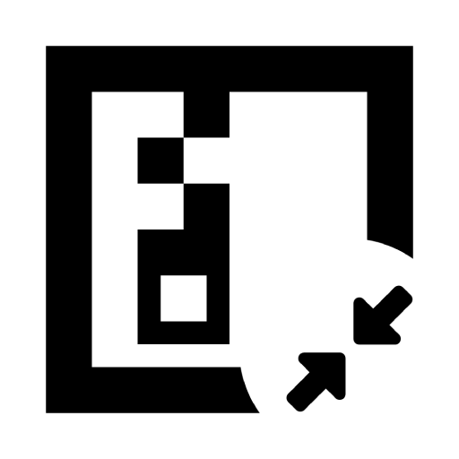

<p align="center">
  <a href="https://github.com/Softorage/7z-GUI-Linux">
    
  </a>
</p>

<h1 align="center">7GL</h1>
<h4 align="center">7z GUI for Linux</h4>

<p align="center">
  A modern, fast, and feature-rich graphical interface for 7-Zip on Linux, with all the advanced features that you are used to, and more.
</p>

<p align="center">
  <a href="https://www.gnu.org/licenses/gpl-3.0"></a>
  <a href="https://golang.org"></a>
  <a href="https://fyne.io"></a>
  <a href="https://github.com/Softorage/7z-GUI-Linux"></a>
</p>

Requires **no external dependencies** other than a 7-Zip backend binary.

### Supported Backends
  - `7zz` — 7-Zip for Linux
  - `7zzs` — Statically linked 7-Zip for Linux (bundled alongside 7GL)
  - `p7zip` — Legacy community build (often pre-installed on Linux distributions)

---

⭐ **Please leave a star if you find 7GL useful!** ⭐

---

> **Note from Developer:**
> - The tool is actively tested for my personal use and works pretty nice. However, it is early in active development. If you find any issues, please let me know via [GitHub Issues](https://github.com/Softorage/7z-GUI-Linux/issues).
> - Although released under Softorage (which receives fewer [visits](https://softorage.com/blog/2026/02/softorage-by-the-numbers/) than you might think), it's maintained by me in my personal free time. Thank you for your support!

---

## Table of Contents

- [Sponsors](#sponsors)
- [Screenshots](#screenshots)
- [Features](#features)
- [Usage](#usage)
  - [Installation & Updates](#installation--updates)
  - [Basic Guide](#basic-guide)
- [Building from Source](#building)
- [FAQ](#faq)
- [Credits](#credits)
- [Other Tools](#other-tools)
- [What is Softorage?](#what-is-softorage)
- [License](#license)

---

## Sponsors

A huge Thank You to everyone who supports us with 'Softorage Open Source Supporter' package!

<a href="https://github.com/MasterCATZ"></a><!--2026-07-27 - 2026-08-27-->

This project is made possible by our amazing backers! View the complete list in [SUPPORTERS.md](./SUPPORTERS.md).

---

## Screenshots

| View | Screenshot |
| --- | --- |
| **Explorer** |  |
| **Clipboard** |  |
| **Compress** |  <br>  |
| **Extract** |  |
| **Checksum** |  <br>  |
| **Operations History** |  |
| **Console Output** |  |

---

## Features

- **Full Compression & Extraction Support**:
   - **Packing / Unpacking**: `.7z`, `.xz`, `.bz2`, `.gz`, `.tar`, `.zip`, `.wim`
   - **Unpacking Only**: `.apfs`, `.ar`, `.arj`, `.cab`, `.chm`, `.cpio`, `.cramfs`, `.dmg`, `.ext`, `.fat`, `.gpt`, `.hfs`, `.ihex`, `.iso`, `.lzh`, `.lzma`, `.mbr`, `.msi`, `.nsis`, `.ntfs`, `.qcow2`, `.rar`, `.rpm`, `.squashfs`, `.udf`, `.uefi`, `.vdi`, `.vhd`, `.vhdx`, `.vmdk`, `.xar`, `.z`
- **Embedded File Explorer**:
   - Standard file management and directory navigation
   - Explore archive contents directly like folders
   - **Nested Archive Exploration**: Deep-browse nested archives (e.g. ZIP inside a ZIP) with high responsiveness and RAM caching (`tmpfs`)
   - Copy/cut/paste from disk-to-archive, archive-to-disk, and archive-to-archive
   - Custom, system-independent descriptive clipboard
- **Security & Compression Customization**:
   - AES-256 password protection & header/filename encryption
   - Full tuning for Compression Method, Level, Dictionary Size, Word Size, Solid Block Size, and CPU Threads
   - Update modes (Add/Replace, Freshen, Synchronize)
   - Self-Extracting (SFX) executables (`.exe`)
   - Volume splitting and shared file compression
   - Guidance and description for various options
- **Live Terminal Logging & History Tracking**:
   - Real-time output stream log and process signal controls (Pause/Resume via `SIGSTOP`/`SIGCONT`)

---

## Usage

### Installation & Updates

1. Download `7z-GUI-Linux` for your CPU architecture from [the official releases](https://softorage.github.io/7z-GUI-Linux/).
2. Extract the downloaded archive.
3. **Portable Mode (No Installation)**:
   - Inside the extracted folder, right-click `7z-GUI-Linux` $\rightarrow$ **Properties** $\rightarrow$ **Permissions** $\rightarrow$ enable **Allow executing file as program** (or run `chmod +x 7z-GUI-Linux`).
   - Double-click `7z-GUI-Linux` to launch.
4. **Installed Mode**:
   - Installing in user space (without `sudo`) is recommended. System-wide installation with `sudo` is also supported.
   - **Install**: Run `install.sh` (ensure executable permissions are set).
   - **Update**: Run `update.sh` (ensure executable permissions are set).
   - **Uninstall**: Run `uninstall.sh` (ensure executable permissions are set).

> **Troubleshooting / Crash Reports:**  
> If you encounter a crash or unexpected exit, please launch the debug build from a terminal (`./7z-GUI-Linux`) and reproduce the issue. Include the console output when opening a report on [GitHub Issues](https://github.com/Softorage/7z-GUI-Linux/issues).

### Basic Guide

#### Adding files to an existing archive:
Inside 7GL's Explorer tab:
1. Copy the file(s) or folder(s) you wish to add.
2. Open the target archive.
3. Press **Paste** into the active archive view.

---

## Building

### Prerequisites
- Go `v1.26+`
- Configured SSH key for GitHub access

```sh
# Clone the repository
git clone git@github.com:Softorage/7z-GUI-Linux.git
cd 7z-GUI-Linux

# Build binary executable
go build -o 7z-GUI-Linux .
```

### Directory Structure

```
7z-GUI-Linux/
├── main.go                     # Minimal entry point (app initialization, lifecycle)
├── FyneApp.toml                # Fyne application build configuration
├── go.mod
├── go.sum
├── README.md
│
├── assets/                     # Embedded resources (logos, icons, SVGs)
│   └── embedded.go             # static resource byte declarations
│
└── internal/                   # Private application packages (enforces Go boundaries)
    │
    ├── domain/                 # Domain models, constants & shared data structures
    │   ├── operation.go        # Operation status, log models, history structures
    │   ├── explorer.go         # File/archive entry models, conflict action enums
    │   └── config.go           # User preferences structure (RAM limits, update toggles)
    │
    ├── sys/                    # System, Memory, & File System Low-Level Utilities
    │   ├── fs.go               # Recursive file operations, unique path generators
    │   ├── memory.go           # Linux RAM/tmpfs inspection & temp workspace allocation
    │   └── updater.go          # GitHub API integration & semver version parser
    │
    ├── engine/                 # 7-Zip CLI Integration & Process Execution
    │   ├── detector.go         # Binary path lookup (7zz, 7zzs, 7z, local ./7zzs)
    │   ├── args.go             # DRY 7-zip CLI argument builder
    │   ├── parser.go           # Archive SLT output & checksum log stream parser
    │   ├── runner.go           # Subprocess execution, SIGSTOP/SIGCONT signals, terminal log handler
    │   └── archive.go          # Multi-stage tarball streaming pipes & password tests
    │
    ├── app/                    # Central State Management & Business Core
    │   ├── state.go            # Thread-safe global app state, progress, & execution locks
    │   ├── clipboard.go        # Virtual and disk clipboard management
    │   └── favorites.go        # User bookmarks management
    │
    └── ui/                     # Presentation Layer (Fyne v2.7.3)
        ├── app.go              # Main layout constructor, sidebar assembly, info bar
        ├── sidebar.go          # Branding, navigation list, external link buttons
        │
        ├── components/         # Reusable UI Modals and Widget Helpers
        │   ├── conflicts.go    # File conflict & type mismatch dialogs
        │   ├── password.go     # Encryption password prompt modal
        │   └── updater.go      # Release update dialog
        │
        └── tabs/               # Isolated tab views
            ├── checksum.go     # Checksum tab layout & event handlers
            ├── compress.go     # Compression tab form & preview
            ├── explorer.go     # File Explorer browser, tab manager & toolbar
            ├── extract.go      # Archive extraction tab & batch queue
            └── status.go       # Real-time operation progress, history list & console log

```

### Development Guidelines

When contributing or modifying code, run standard Go quality checks:

```sh
# Format source files
go fmt ./...

# Auto-update imports and format the code
# `goimports` updates the import statements for you and formats the code.
# -w writes the changes to the files.
# . runs it on the current directory and subdirectories.
goimports -w .

# Check for common mistakes like unreachable code, printf format mismatches, and shadowed variables with `go vet`.
# You can also run `golangci-lint run` for a comprehensive check. It is a "meta-linter" that runs go vet, staticcheck, and dozens of other tools simultaneously.
go vet ./...

# Run unit test suite across internal packages
go test ./...

# Remove unused dependencies and adds missing ones to your go.mod and go.sum files
go mod tidy
```

---

## FAQ

1. **Do you know how to code? Do you use AI to develop this project? Is this vibe-coded?**  
   - Yes. I think, I may kinda know how to code. I am fairly confident that I understand the code I maintain (I keep forgetting though). Sometimes, there do appear parts of code (often via LLMs) that work and I don't quite understand how (and I have to ask to understand). But hey, that was the case even in StackOverflow days. I guess I'm dumb, just not enough to constantly keep messing the code. (-> Sanmay)  
   - Yeah. I use LLMs mostly to discuss alternative implementations. I copy parts of code when discussing, and the LLM never has `write access` to files in the repo. Yes, I read the code. If you find any issues, please report them. Will try to fix them as soon as possible.  
   - That's anyone's judgement.

---

## Credits

- [7-Zip](https://www.7-zip.org/) by Igor Pavlov
- [p7zip](https://sourceforge.net/projects/p7zip/)
- [Softorage](https://softorage.com/)

---

## Other Tools

Looking for a throttlestop alternative for your Intel CPU on Linux? Check out our other open-source tool: [undervolt-go](https://github.com/Softorage/undervolt-go). It comes with all the risks of a system level utility, though.

---

## What is Softorage?

Softorage is a software discovery platform built on user trust and safety. Rather than hosting binary mirrors (which introduces security and package manipulation risks), Softorage directs users directly to verified official developer channels.

---

## License

This project is licensed under the **GNU General Public License v3.0**. See the [LICENSE.txt](LICENSE.txt) file for details.

### NO WARRANTY

THE SOFTWARE IS PROVIDED "AS IS", WITHOUT WARRANTY OF ANY KIND, EXPRESS OR IMPLIED, INCLUDING BUT NOT LIMITED TO THE WARRANTIES OF MERCHANTABILITY, FITNESS FOR A PARTICULAR PURPOSE AND NONINFRINGEMENT. IN NO EVENT SHALL THE AUTHORS OR COPYRIGHT HOLDERS BE LIABLE FOR ANY CLAIM, DAMAGES OR OTHER LIABILITY, WHETHER IN AN ACTION OF CONTRACT, TORT OR OTHERWISE, ARISING FROM, OUT OF OR IN CONNECTION WITH THE SOFTWARE OR THE USE OR OTHER DEALINGS IN THE SOFTWARE.
